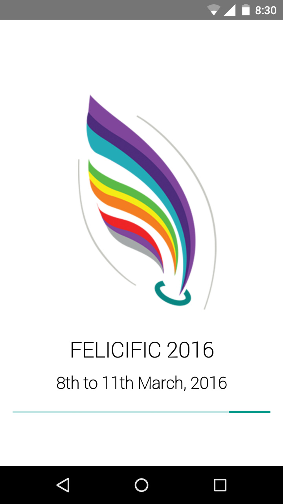
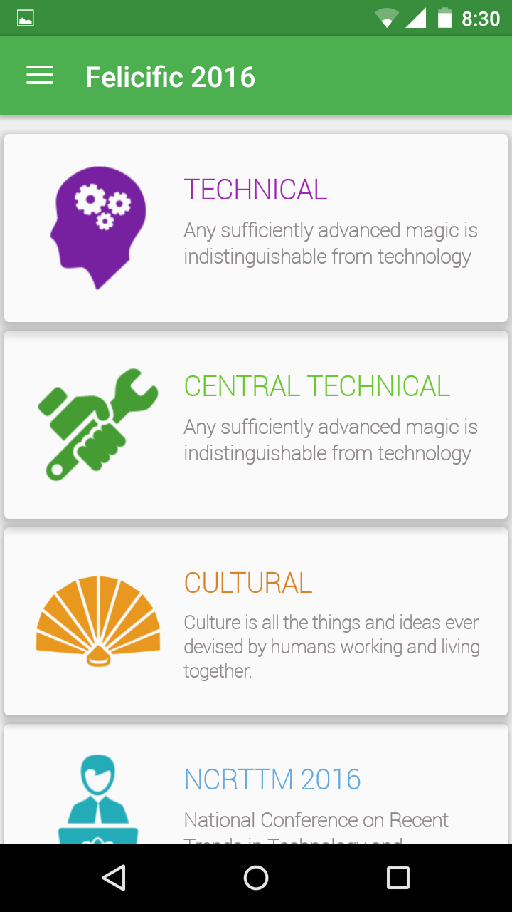
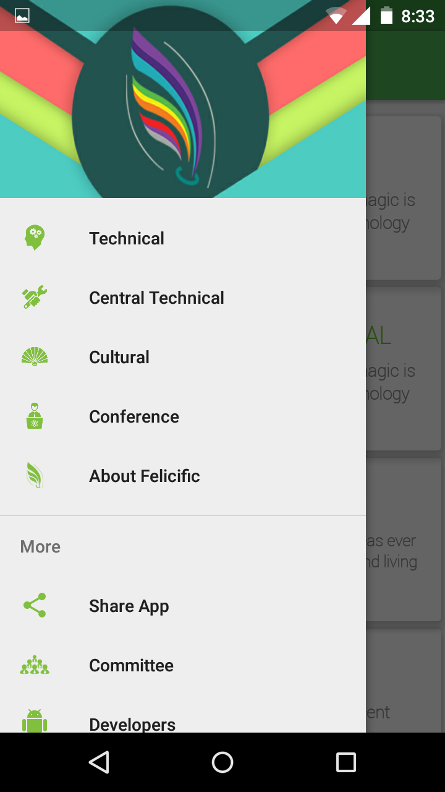
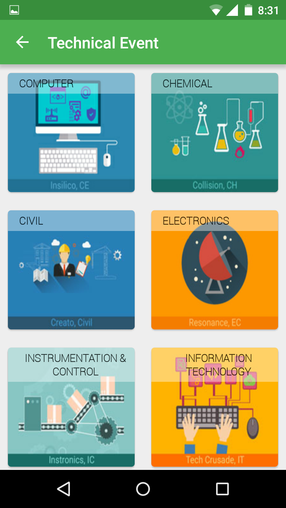
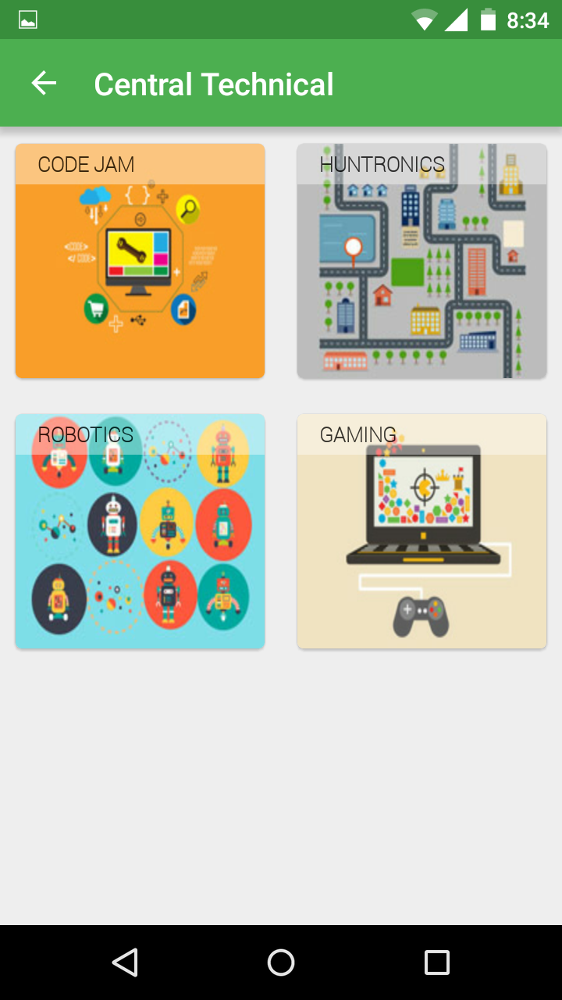
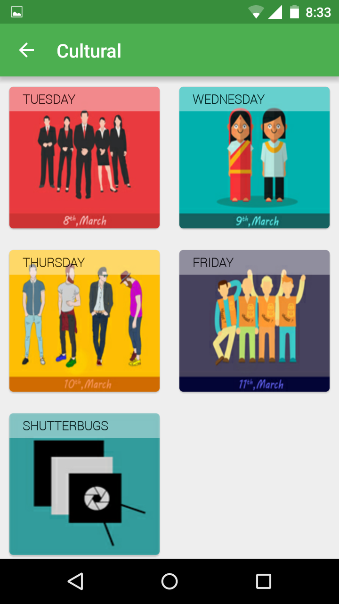
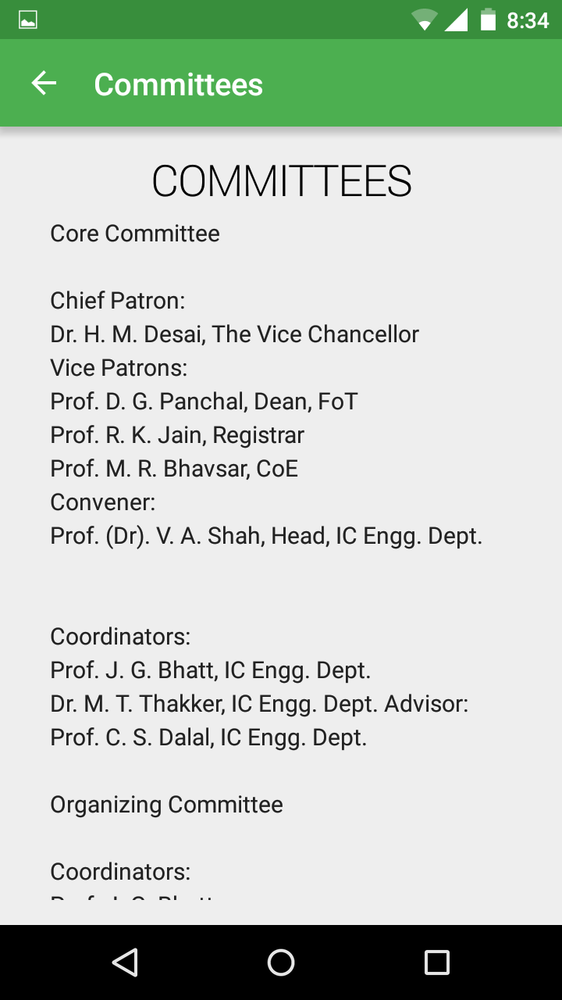

# Felicific 2016 Android App Project
----------
## University's Techno-Cultural Festival's Android Application.

## Android Technology/Framework
+ We used
	* Android Studio as IDE
	* Material Designed App
	* Recycler-View
	* Card-View
	* RESTful API
	* JSON
	
## Demo
### Screenshots of the App	
	
	
	
	
	
	
	
	
Developer:-  
- Vimox S Shah(myself)
- Akshay Bosamiya